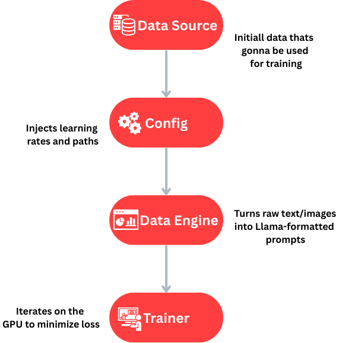
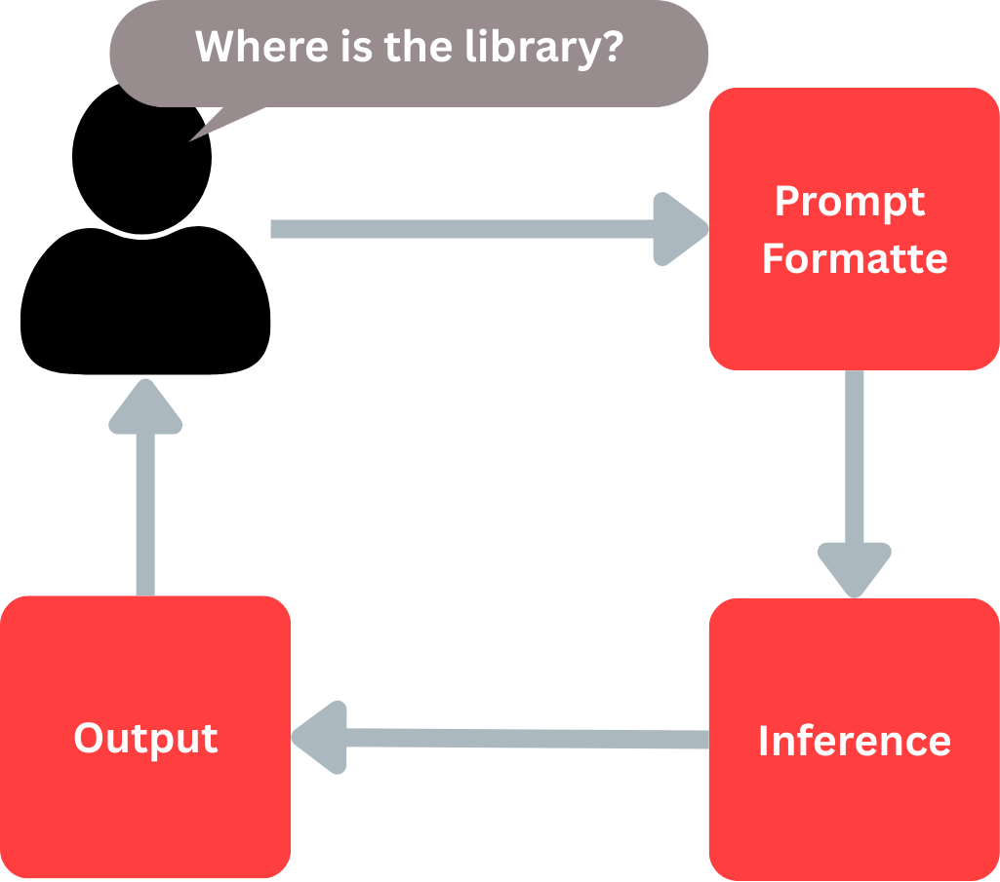
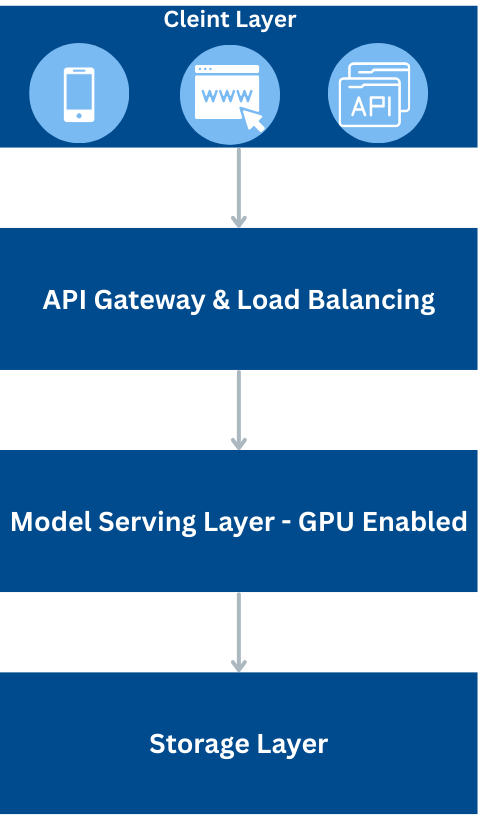

## Project Overview

- **Objective**: [e.g., Fine-tuning Llama-3.2 for Campus Map Navigation]
- **Base Model**: `meta-llama/Llama-3.2-3B`
- **Methodology**: QLoRA (8-bit quantization + Low-Rank Adaptation)

---

##  I. Modular Directory Structure

| Folder/File        | Purpose                                                           |
|--------------------|-------------------------------------------------------------------|
| `config/`          | **Control Center**. Contains all hyperparameters and hardware paths. |
| `src/data_eng.py`  | **The Chef**. Cleans raw data and prepares "Instruction" prompts.   |
| `src/model_eng.py` | **The Mechanic**. Loads the model and applies LoRA layers.          |
| `src/inference.py` | **The Interface**. Logic for generating answers from new inputs.    |
| `Main.py`          | **The Orchestrator**. Runs the training pipeline from start to finish. |

---

## II. Data Pipeline (The "Mapping" Logic)

For map-related projects, we use a **Normalized Coordinate System**:

1. **Input**: Image pixels (e.g., 4000x3000)
2. **Transformation**: Map all coordinates to a `[0, 1000]` grid
3. **Tokenization**: Represent coordinates as text strings (e.g., `<x_500><y_200>`)

---

## ️ III. Architectural Flow Diagrams

### A. Training Pipeline (The "Factory" Flow)

This diagram shows how data moves through your modular folders to create a trained model.



**Flow Steps:**

1. **Data Source**: Pulls from Kaggle/Local folders
2. **Config**: Injects learning rates and paths
3. **Data Engine**: Turns raw text/images into Llama-formatted prompts
4. **Trainer**: Iterates on the GPU to minimize loss

---

### B. Universal Inference Flow (The "User" Experience)

This is the logic used in your `Predict.py` script.



**Flow Steps:**

1. **User Input**: "Where is the library?"
2. **Prompt Formatter**: Wraps the question in the `Llama-3` template
3. **Inference**: The model predicts the next tokens (text or coordinates)
4. **Output**: The text is returned to the user or drawn on a map

---

## 🚀 IV. Deployment Strategy (The "Scaling" Flow)

When you move from a Kaggle Notebook to a real server, the architecture changes slightly to handle multiple users.




---

## Directory Structure
```
project-root/
├── README.md
├── Main.py
├── config/
│   ├── model_config.py
│   └── train_config.py
├── src/
│   ├── data_eng.py
│   ├── model_eng.py
│   └── Inference.py
├── images/
│   ├── training-pipeline.png
│   ├── inference-flow.png
│   └── deployment-architecture.png
└── Data/
    └── [your datasets]
```

---

## 🎯 Quick Commands
```bash
# Training
python Main.py --config config/config.yaml

# Inference
python src/predictor.py --input "Where is the library?"

# Deployment (with vLLM)
python -m vllm.entrypoints.api_server --model ./fine-tuned-model
```


**Last Updated**: 5-1-2026 
**Maintained By**: The jammoul